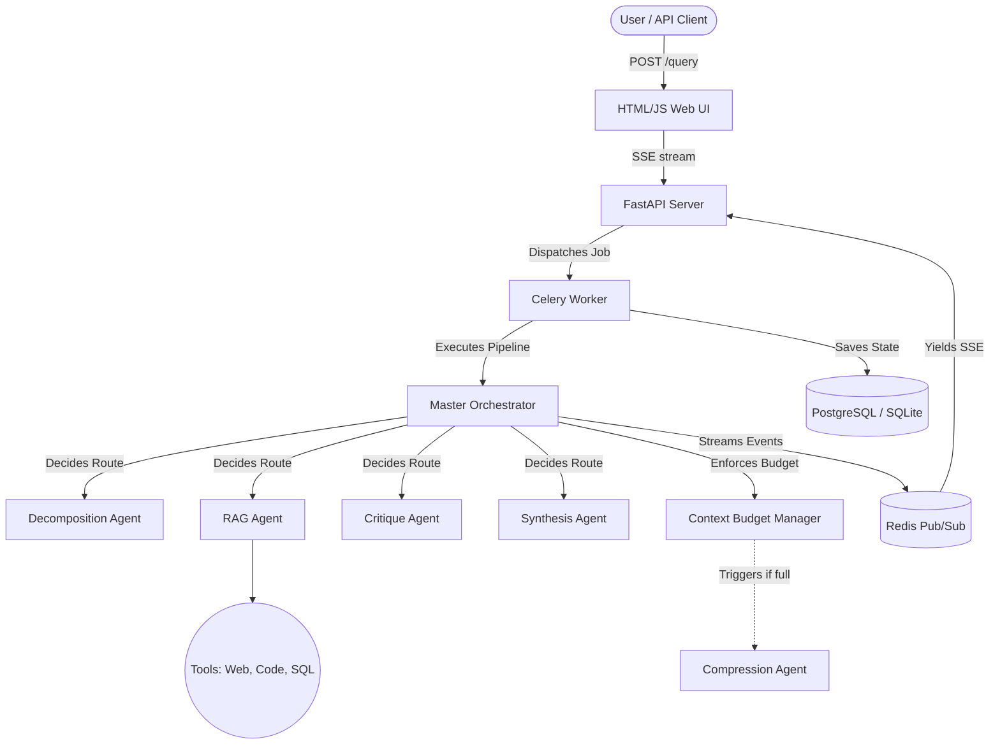

# Mega AI: Real-Time Multi-Agent LLM Orchestration

A containerized, production-grade multi-agent system featuring dynamic tool orchestration, a strict context budget manager, and a self-improving evaluation loop.

## Setup Instructions

### Prerequisites
- Docker and Docker Compose
- A Groq API Key

### Quickstart
1. Clone this repository.
2. Create a `.env` file in the root directory and add your API key:
   ```env
   GROQ_API_KEY=your_groq_api_key_here
   GROQ_MODEL=llama-3.3-70b-versatile
   ```
3. Run `docker-compose up -d`.
4. The system is now running:
   - **Frontend UI & API**: http://localhost:8000
   - **API Docs**: http://localhost:8000/docs
   - **Redis Commander (Logs/State)**: http://localhost:8081

To test the system, simply navigate to `http://localhost:8000` in your browser and type a query!

---

## Architecture Diagram



---

## Agent Decision Boundaries

- **Master Orchestrator**: The "brain." It does not process the query itself. It reads the current context state, decides which agent needs to act next, and strictly enforces the context window budget.
- **Decomposition Agent**: The "planner." Breaks ambiguous queries into a typed, structured dependency graph. Never executes tools.
- **RAG Agent**: The "researcher." Performs multi-hop reasoning. Given sub-tasks, it uses tools (Web Search, SQL) to gather evidence. Must cite sources.
- **Critique Agent**: The "auditor." Reviews the RAG outputs. It does not write the final answer. It only flags specific claims it disagrees with and assigns confidence scores.
- **Synthesis Agent**: The "writer." Takes the original query, the research, and the critique. Resolves contradictions and generates the final, readable output for the user.
- **Compression Agent**: The "summarizer." Triggered dynamically by the orchestrator when an agent exceeds 85% of its context budget. Compresses older conversational filler losslessly.
- **Meta Agent**: The "coach." Runs post-evaluation. Reads failure cases, proposes prompt rewrites for underperforming agents, and stages them for human approval.

---

## Known Limitations & Failure Modes

**Where the system breaks (Honest Assessment):**
1. **Tool Fallback Loops**: If a tool repeatedly returns malformed data (e.g., a broken SQL schema), the agent might burn its token budget retrying before the fallback catches it.
2. **Context Compression Loss**: While the compression agent attempts lossless compression for structured data, deeply nested tool outputs might lose critical nuance if summarized too aggressively.
3. **LLM Orchestration Failure**: If the LLM routing the Orchestrator hallucinates a non-existent action, it falls back to a deterministic chain (`_fallback_routing`). While safe, this bypasses the dynamic routing benefit entirely for that step.
4. **Latency**: Because inter-agent communication forces sequential LLM calls, deep multi-hop queries can take 15-30 seconds to resolve.

## The Self-Improving Loop

**What it does:**
- Analyzes the results of the 15-case evaluation harness.
- Identifies the lowest-scoring dimension (e.g., `citation_accuracy`).
- Proposes a git-style diff to rewrite the prompt of the failing agent.
- Stores the proposal in the database for human review.

**What it does NOT do:**
- It does not automatically apply prompts to production (prevents catastrophic degradation).
- It does not fine-tune the model weights.
- It does not write new tools or code; it only tweaks agent system prompts.

---

## What's Next?
If I had more time, I would build:
1. **Semantic Caching**: To instantly return synthesis results for identical/similar queries to reduce LLM costs.
2. **Parallel Sub-task Execution**: The orchestrator currently runs RAG sequentially. I would refactor the worker to allow `asyncio.gather` for independent sub-tasks.
3. **Streaming Tool Outputs**: Streaming stdout/stderr from the python code sandbox back to the client directly via SSE.
