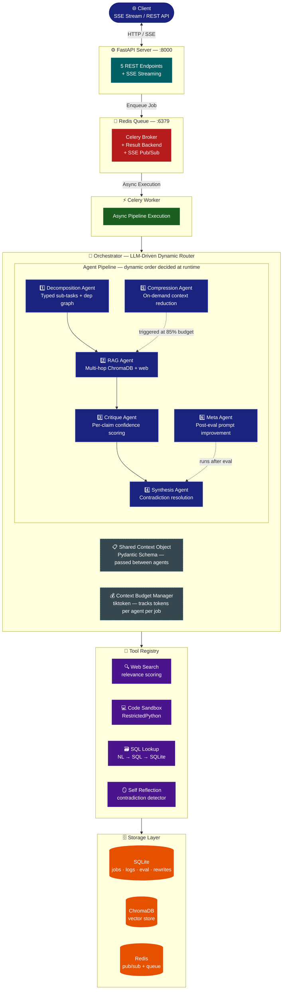
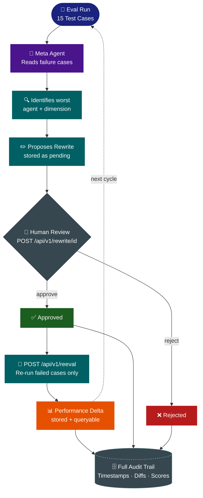

<div align="center">


[](https://git.io/typing-svg)

<br/>

[](https://python.org)
[](https://fastapi.tiangolo.com)
[](https://groq.com)
[](https://docs.celeryq.dev)
[](https://trychroma.com)
[](https://docker.com)
[](LICENSE)

> *Production-grade multi-agent system with dynamic orchestration, retrieval-augmented generation, adversarial evaluation, and a self-improving prompt loop* 🤖

</div>

---

## 📋 Table of Contents

<div align="center">

| | | |
|:---:|:---:|:---:|
| [⚡ Quick Start](#-quick-start) | [🏗️ System Architecture](#%EF%B8%8F-system-architecture) | [🔄 Agent Pipeline](#-agent-pipeline) |
| [🔁 Self-Improving Loop](#-self-improving-prompt-loop) | [🤖 Agents](#-agents) | [🛠️ Tools](#%EF%B8%8F-tools) |
| [📊 Evaluation Pipeline](#-evaluation-pipeline) | [💰 Context Budget](#-context-budget-management) | [📡 API Endpoints](#-api-endpoints) |
| [📦 Services](#-services) | [📁 Project Structure](#-project-structure) | [🌐 Environment Variables](#-environment-variables) |
| [🛠️ Tech Stack](#%EF%B8%8F-tech-stack) | [🧪 Running Tests](#-running-tests) | [⚠️ Known Limitations](#%EF%B8%8F-known-limitations) |

</div>

---

## ⚡ Quick Start

```bash
git clone https://github.com/GeetishM/multi-agent-system.git
cd multi-agent-system

# Copy and configure environment
cp .env.example .env
# Open .env and set: GROQ_API_KEY=your_key_here

# Start all services
docker compose up
```

> 📖 Visit **http://localhost:8000/docs** — interactive API docs  
> 📊 Visit **http://localhost:8081** — Redis Commander UI  
> 🔑 Get your free Groq API key at [console.groq.com/keys](https://console.groq.com/keys)

---

## 🏗️ System Architecture



---

## 🔄 Agent Pipeline

```mermaid
flowchart LR
    Q([❓ User Query]):::input

    Q --> D

    D[1️⃣ Decomposition\nAgent]:::agent
    D -->|typed sub-tasks\n+ dep graph| R

    R[2️⃣ RAG Agent]:::agent
    R -->|ChromaDB + Web\nmulti-hop retrieval| C

    C[3️⃣ Critique Agent]:::agent
    C -->|per-claim confidence\n0.0–1.0 scoring| S

    S[4️⃣ Synthesis Agent]:::agent
    S -->|contradiction\nresolution| OUT

    COMP[5️⃣ Compression Agent]:::compress
    META[6️⃣ Meta Agent]:::meta

    R -.->|85% budget hit| COMP
    COMP -.->|compressed context| S
    OUT -.->|after eval cycle| META
    META -.->|pending rewrite\nawaits human approval| DB[(🗄️ DB)]:::db

    OUT([✅ Final Answer\n+ Provenance Map]):::output

    classDef input    fill:#1A237E,color:#fff,stroke:none
    classDef agent    fill:#006064,color:#fff,stroke:none
    classDef compress fill:#E65100,color:#fff,stroke:none
    classDef meta     fill:#4A148C,color:#fff,stroke:none
    classDef db       fill:#37474F,color:#fff,stroke:#80CBC4,stroke-dasharray:3
    classDef output   fill:#1B5E20,color:#fff,stroke:none
```



---

## 🔁 Self-Improving Prompt Loop



---

## 🤖 Agents

<details>
<summary><b>🧠 Orchestrator — Master Controller (click to expand)</b></summary>

<br/>

The master controller. Uses an LLM to dynamically decide at runtime which sub-agent to invoke next, in what order, and with what context. Routing decisions are **never hardcoded** — they are made via structured reasoning and logged with justification.

- Handles RAG retries with refined queries (up to 2 retries)
- Triggers compression at **85% budget**
- Logs all policy violations

**Decision boundaries:** Called with current pipeline state (`completed_actions`, `remaining_actions`, `claims`, `budget_status`) → receives JSON routing decision with justification. Falls back to deterministic routing if LLM call fails.

</details>

<details>
<summary><b>🔀 Decomposition Agent — Sub-task Planner (click to expand)</b></summary>

<br/>

Breaks ambiguous queries into typed sub-tasks with explicit dependency relationships.

**Sub-task types:** `retrieval` · `calculation` · `comparison` · `summarization` · `analysis` · `code_execution` · `data_lookup`

- Dependent sub-tasks do not execute until dependencies resolve
- Max **6 sub-tasks** per query

**Decision boundaries:** Short/unambiguous input → single sub-task. JSON parse failure → single generic analysis task to avoid blocking pipeline.

</details>

<details>
<summary><b>📚 RAG Agent — Multi-Hop Retriever (click to expand)</b></summary>

<br/>

Performs multi-hop retrieval across **at least two sources** before forming an answer — ChromaDB (local vector store) and the web search tool.

- Every factual claim tagged with `[chunk_id:X]` citations
- Uses cosine similarity scoring (ChromaDB) + keyword-overlap relevance (web)
- **Single-hop retrieval is explicitly not sufficient**

**Decision boundaries:** Fewer than 2 chunks retrieved → reports insufficient context rather than hallucinating. Malformed LLM JSON → raw response stored in context metadata for debugging.

</details>

<details>
<summary><b>🔍 Critique Agent — Per-Claim Evaluator (click to expand)</b></summary>

<br/>

Reviews output of every other agent at the **claim level** — never at the whole-output level.

- Assigns confidence score (0.0–1.0) per claim
- Flags specific text spans + reasons for claims below **0.6 confidence**
- At budget exceeded: applies shallow critique (reduces all scores by 0.1) rather than skipping

**Decision boundaries:** Only runs if claims exist in shared context. Produces structured JSON per claim. Parse failure → preserves original scores rather than zeroing them.

</details>

<details>
<summary><b>🔗 Synthesis Agent — Contradiction Resolver (click to expand)</b></summary>

<br/>

Merges outputs from all sub-agents, resolves contradictions flagged by the Critique Agent, and produces a final answer with a **provenance map** linking each sentence to its source agent and chunk.

- Contradictions resolved internally — **never surfaced to the user**
- Budget exceeded → falls back to best RAG output directly

**Decision boundaries:** Prioritizes higher-confidence claims. Documents every resolution decision in `resolved_contradictions` metadata.

</details>

<details>
<summary><b>🗜️ Compression Agent — Context Reducer (click to expand)</b></summary>

<br/>

Called by the orchestrator when any agent reaches **85%** of its token budget. Applies lossy compression **only to conversational filler**.

- Structured data (tool outputs, numeric scores, citations, JSON) → always preserved **losslessly**
- Returns compressed text marked with `[COMPRESSED]`
- Budget exceeded by compression agent itself → hard-truncates at 1000 chars + logs policy violation

**Decision boundaries:** Only compresses, never summarizes structured data. Compression ratio logged for observability.

</details>

<details>
<summary><b>🧬 Meta Agent — Prompt Improver (click to expand)</b></summary>

<br/>

Runs after each eval cycle. Reads failure cases, identifies the **worst-performing agent-dimension combination**, and proposes a rewritten system prompt with structured diff and justification.

- Proposed rewrite stored as `pending` in the database
- **Never automatically applied** — human must approve via API

**Decision boundaries:** Analyses only top 3 failure cases (context budget). If no dimension scores below 0.6 on average → returns `no_rewrite_needed`. Does not propose rewrites for orchestrator routing logic.

</details>

---

## 🛠️ Tools

<div align="center">

| Tool | Description | Failure Codes |
|:---:|:---|:---|
| 🔍 **Web Search** | Structured results with URLs, relevance scores, chunk IDs. Stub backed by curated knowledge base. Replace with Tavily/SerpAPI in production. | `TIMEOUT` · `MALFORMED` · `EMPTY_RESULTS` |
| 💻 **Code Sandbox** | Executes Python via RestrictedPython. Returns `stdout`, `stderr`, `exit_code`. Blocks dangerous imports (`os`, `sys`, `subprocess`). | `MALFORMED` (empty/blocked) · `exit_code: 1` (runtime) |
| 🗃️ **SQL Lookup** | Converts natural language → SQLite SQL via rule-based patterns or Groq LLM. Queries sample products, sales, customer data. | `MALFORMED` · `EXECUTION` · `EMPTY_RESULTS` |
| 🪞 **Self Reflection** | Agent calls this to re-read its own previous outputs and detect contradictions with a new claim. Rule-based locally, LLM-based when client available. | `EMPTY_RESULTS` · `MALFORMED` |

</div>

---

## 📊 Evaluation Pipeline

### Test Cases (15 total)

<div align="center">

| Category | Count | Description |
|:---:|:---:|:---|
| ✅ Baseline | 5 | Straightforward queries with known correct answers |
| 🌀 Ambiguous | 5 | Underspecified inputs designed to test decomposition quality |
| ⚔️ Adversarial | 5 | Prompt injections, confident wrong premises, contradiction traps |

</div>

### Scoring Dimensions (6 per case)

<div align="center">

| Dimension | What It Measures | Method |
|:---:|:---|:---:|
| 🎯 Correctness | Final answer accuracy vs expected | LLM judge |
| 📎 Citation | Inline chunk citations present and accurate | Rule-based + coverage |
| 🔗 Contradiction Resolution | Contradictions resolved before reaching user | Structural check |
| ⚡ Tool Efficiency | Penalizes unnecessary tool calls and retries | Rule-based |
| 💰 Budget Compliance | Did agents stay within token budgets | Policy violation count |
| 🤝 Critique Agreement | Final answer aligns with critique assessments | Claim exclusion rate |

</div>

Every dimension produces a numeric score (0.0–1.0) and a written justification. Every eval run is stored with **full reproducibility**: exact prompts, tool calls, outputs, scores, and timestamps.

### Running the Eval

```bash
# Full 15-case eval via API (runs in background)
curl -X POST http://localhost:8000/api/v1/eval/run

# Quick 3-case local test (saves Groq quota)
cd api && python test_eval.py

# Check results
curl http://localhost:8000/api/v1/eval
```

---

## 💰 Context Budget Management

Each agent declares a maximum token budget. The `ContextBudgetManager` tracks consumption per agent per job using **tiktoken** (`cl100k_base` encoding).

<div align="center">

| Agent | Default Budget | Trigger |
|:---:|:---:|:---|
| 🧠 Orchestrator | 4,000 tokens | Falls back to deterministic routing at limit |
| 🔀 Decomposition | 3,000 tokens | Returns single task at limit |
| 📚 RAG | 5,000 tokens | Reports insufficient context at limit |
| 🔍 Critique | 3,000 tokens | Applies shallow critique (−0.1) at limit |
| 🔗 Synthesis | 4,000 tokens | Returns best RAG output at limit |
| 🗜️ Compression | 2,000 tokens | Hard-truncates at 1000 chars at limit |
| 🧬 Meta | 3,000 tokens | Returns `no_rewrite_needed` at limit |

</div>

> Agents that exceed their budget are **caught and logged as policy violations — never silently truncated**. At 85% usage, compression is triggered automatically. All budgets configurable via environment variables.

---

## 📡 API Endpoints

<div align="center">

| Method | Endpoint | Description |
|:---:|:---:|:---|
| `POST` | `/api/v1/query` | Submit query — real-time SSE stream with agent activity, tool calls, budget |
| `GET` | `/api/v1/trace/{job_id}` | Full trace: agent sequence, tool calls, handoffs, timings |
| `GET` | `/api/v1/eval` | Latest eval summary by category and scoring dimension |
| `POST` | `/api/v1/eval/run` | Trigger full 15-case eval run in background |
| `POST` | `/api/v1/rewrite/{id}` | Submit human approval or rejection for pending rewrite |
| `GET` | `/api/v1/rewrite/pending` | List all pending rewrites awaiting human review |
| `POST` | `/api/v1/reeval` | Re-run eval on previously failed cases with latest approved prompt |
| `GET` | `/health` | Health check |

</div>

> All error responses include a machine-readable `error_code`, a human-readable `message`, and `job_id` where applicable.

---

## 📦 Services

<div align="center">

| Service | Port | Purpose |
|:---:|:---:|:---|
| `mas_api` | `:8000` | FastAPI server, SSE streaming, all endpoints |
| `mas_worker` | — | Celery background worker for async pipeline jobs |
| `mas_redis` | `:6379` | Message broker, result backend, SSE pub/sub |
| `mas_redis_ui` | `:8081` | Redis Commander — visual queue/log browser |

</div>

---

## 📁 Project Structure

<details>
<summary><b>📂 Click to expand full structure</b></summary>

```
multi-agent-system/
├── 🐳 docker-compose.yml
├── 🔐 .env.example
├── 📖 README.md
├── api/
│   ├── Dockerfile
│   ├── requirements.txt
│   ├── main.py
│   ├── agents/
│   │   ├── base.py              # BaseAgent ABC
│   │   ├── orchestrator.py      # Master controller
│   │   ├── decomposition.py     # Sub-task decomposition
│   │   ├── rag.py               # Multi-hop RAG
│   │   ├── critique.py          # Per-claim critique
│   │   ├── synthesis.py         # Contradiction resolution
│   │   ├── compression.py       # Context compression
│   │   └── meta.py              # Prompt improvement
│   ├── tools/
│   │   ├── base.py              # BaseTool with failure contract
│   │   ├── web_search.py        # Structured search stub
│   │   ├── code_sandbox.py      # RestrictedPython executor
│   │   ├── sql_lookup.py        # NL → SQL → SQLite
│   │   └── self_reflection.py   # Contradiction detector
│   ├── core/
│   │   ├── context.py           # SharedContext Pydantic schema
│   │   ├── budget.py            # Token budget manager
│   │   ├── logger.py            # Structured logger + trace builder
│   │   └── database.py          # SQLAlchemy models + async engine
│   ├── eval/
│   │   ├── test_cases.py        # 15 test cases (5+5+5)
│   │   ├── scorer.py            # 6-dimensional scorer
│   │   └── harness.py           # Eval orchestration + storage
│   └── worker/
│       ├── celery_app.py        # Celery configuration
│       └── tasks.py             # Pipeline, eval, reeval tasks
└── data/
    └── knowledge/
        └── sample_docs.txt
```

</details>

---

## 🌐 Environment Variables

<details>
<summary><b>⚙️ Click to expand full .env reference</b></summary>

```env
# Required
GROQ_API_KEY=gsk_...                      # Get from console.groq.com/keys
GROQ_MODEL=llama-3.3-70b-versatile        # Model to use

# Database
DATABASE_URL=sqlite+aiosqlite:////app/data/multi_agent.db

# Redis
REDIS_URL=redis://redis:6379/0

# ChromaDB
CHROMA_PERSIST_DIR=/app/data/chroma_data

# App
APP_ENV=development
LOG_LEVEL=INFO
MAX_RETRIES=2

# Context budgets (tokens per agent)
ORCHESTRATOR_BUDGET=4000
DECOMPOSITION_BUDGET=3000
RAG_BUDGET=5000
CRITIQUE_BUDGET=3000
SYNTHESIS_BUDGET=4000
COMPRESSION_BUDGET=2000
META_BUDGET=3000
```

</details>

---

## 🛠️ Tech Stack

<div align="center">

| Layer | Technology | Why |
|:---:|:---:|:---|
| 🧠 LLM |  | Free tier, fast inference, function calling |
| ⚙️ API |  + SSE-Starlette | Async, automatic docs, native SSE support |
| 📨 Queue |  +  | Async job processing, pub/sub for SSE |
| 📦 Vector DB | `ChromaDB` | Local, free, cosine similarity search |
| 🔢 Embeddings | `sentence-transformers` | Local, no API cost |
| 🗄️ Database | `SQLite` + SQLAlchemy async | Zero-config, sufficient for single-node |
| 🔤 Tokens | `tiktoken` | Same tokenizer as most LLMs |
| 💻 Sandbox | `RestrictedPython` | Safe Python execution without Docker-in-Docker |
| 🐳 Infra |  | One-command startup |

</div>

---

## 🧪 Running Tests

```bash
cd api

# Test all 4 tools
python test_tools.py

# Test all agents individually
python test_agents.py

# Test the full orchestrator pipeline
python test_orchestrator.py

# Run 3-case eval (saves Groq quota)
python test_eval.py
```

---

## ⚠️ Known Limitations

<details>
<summary><b>📋 Click to expand limitations & roadmap</b></summary>

<br/>

| Limitation | Detail | Production Fix |
|:---|:---|:---|
| 🔍 **Web search is stubbed** | Static 10-doc knowledge base with keyword scoring | Replace `tools/web_search.py` with Tavily or SerpAPI |
| 🧲 **Generic embeddings** | `all-MiniLM-L6-v2` is general-purpose | Fine-tuned domain embedder for better retrieval |
| 🔁 **Rewrites not persisted to code** | Approved rewrites update in-memory only | Intentional — automatic code modification without review is unsafe |
| 🔐 **Code sandbox not fully isolated** | RestrictedPython is not a true security boundary | Use containerized sandbox (AWS Lambda, Firecracker) for production |
| 👤 **Celery runs as root in Docker** | Acceptable for dev, not production | Use `--uid` or rootless container runtime |
| ✍️ **SQLite concurrency limits** | Single-writer constraint with multiple Celery workers | Switch to PostgreSQL for multi-worker deployments |
| ⚖️ **LLM judge inconsistency** | Correctness scoring can vary across eval runs | Replace with BERTScore, ROUGE-L, or a dedicated eval model |

</details>

---

## 🚀 What I Would Build Next

<div align="center">

| Feature | Description |
|:---:|:---|
| 🔍 **Real Web Search** | Replace stub with Tavily API — one-file swap in `tools/web_search.py` |
| 🐘 **PostgreSQL Backend** | Drop-in for SQLite — enables concurrent workers + proper indexing |
| ⚡ **Token-by-Token SSE** | Wire each agent's `chat()` to stream individual tokens via Groq streaming |
| 🔁 **Rewrite CI Pipeline** | GitHub Action that runs eval on every PR and auto-proposes rewrites on regression |
| 🧠 **Episodic Agent Memory** | Store successful reasoning chains in ChromaDB for few-shot injection |
| 🖥️ **Human-in-the-Loop Dashboard** | React/Streamlit UI for live pipeline progress, eval results, pending rewrites |

</div>

---

## 📋 Structured Log Schema

```json
{
  "log_id": "01KR3...",
  "job_id": "01KR3...",
  "agent_id": "rag",
  "event_type": "agent_end",
  "input_hash": "a1b2c3d4e5f6...",
  "output_hash": "f6e5d4c3b2a1...",
  "latency_ms": 1419.08,
  "token_count": 325,
  "policy_violation": false,
  "violation_detail": null,
  "metadata": {},
  "timestamp": "2026-05-08T10:14:22Z"
}
```

> Queryable via `GET /api/v1/trace/{job_id}` — reconstructs the exact sequence of agent decisions, tool calls, and handoffs in order.

---

## 📄 License

MIT — free to use, modify, and distribute.

---

<div align="center">

*Built as a assessment project demonstrating production-grade LLM engineering patterns* 🤖

⭐ If this project impressed you, consider giving it a star!


</div>
